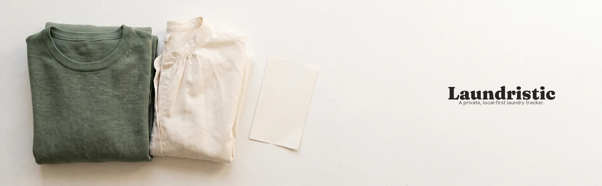
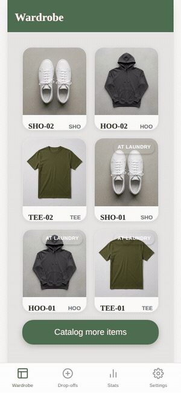
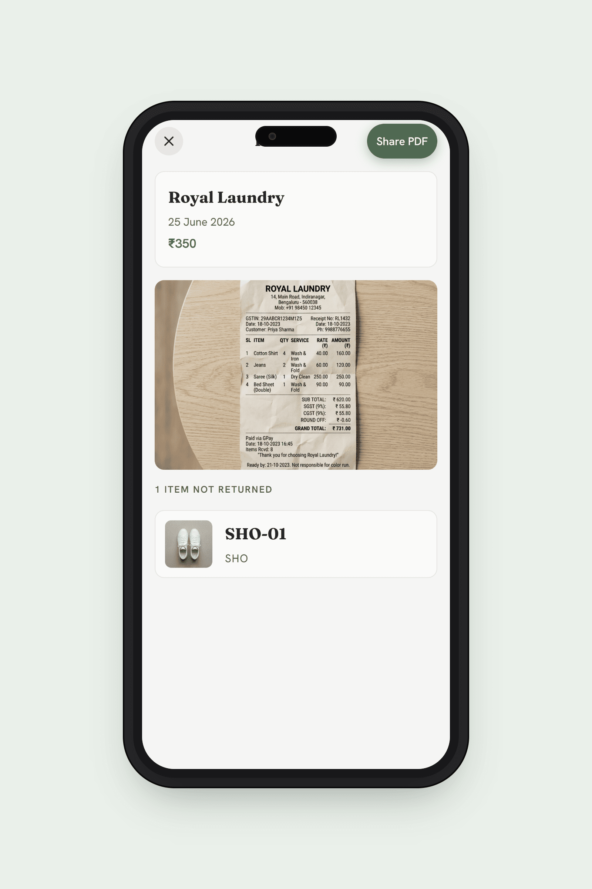
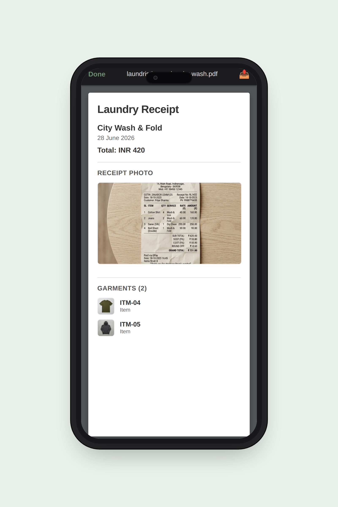
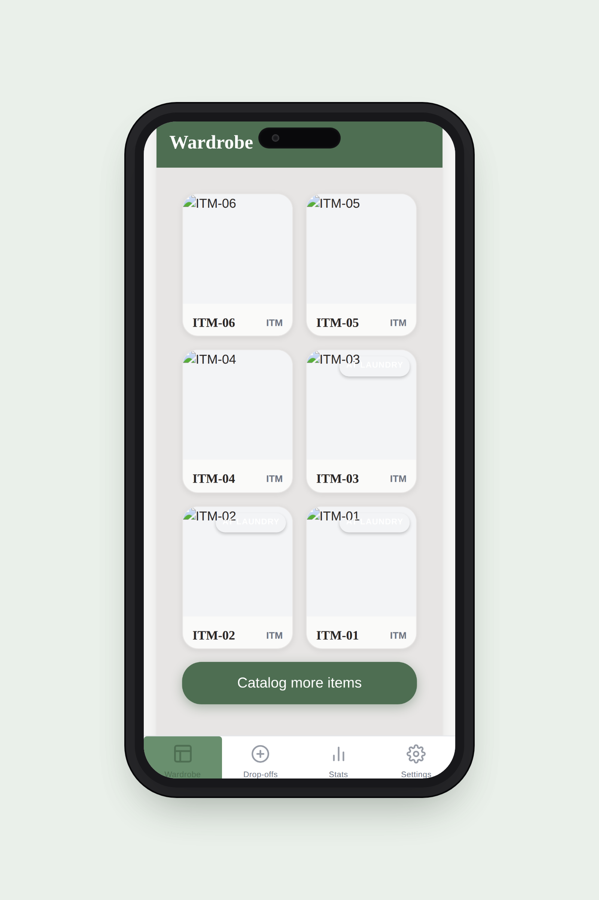
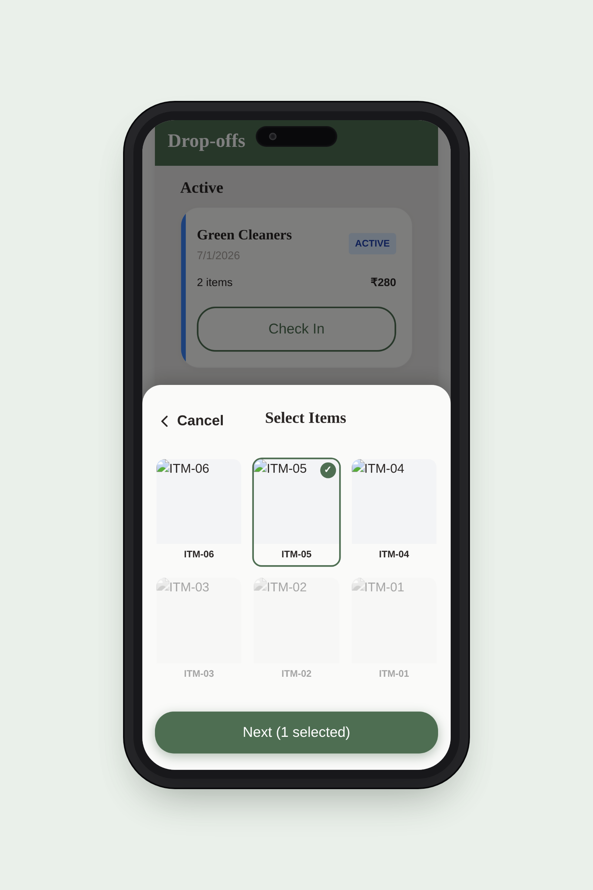
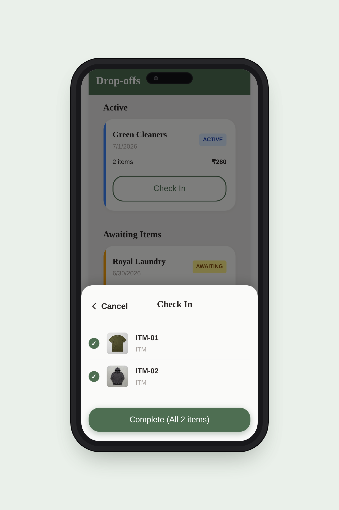
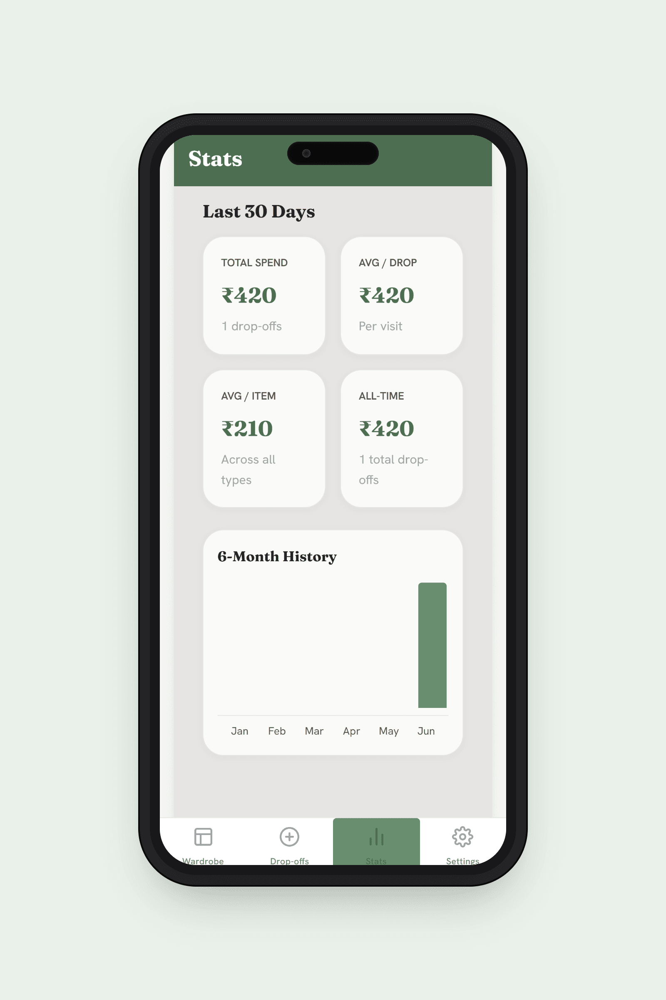

<p align="center">
  
</p>

# Laundristic

_Never lose a garment again._

<p align="center">
  
</p>

Laundristic is a local-first Progressive Web App (PWA) designed for people who hand their laundry to a shop weekly and want a reliable way to keep track of it. It focuses on speed and simplicity—no accounts, no cloud sync, and no typing required. Just photos and taps.

<p align="center">
  <a href="https://github.com/GitPhantom700/laundristic-p1/releases/download/media-assets/Laundristic_s_offline_proof_for_lost_laundry.m4a">📻 Listen to a deep dive</a>
  ·
  <a href="https://github.com/GitPhantom700/laundristic-p1/releases/download/media-assets/Laundristic_Lifecycle.mp4">🎬 Watch a deep dive</a>
</p>

## Features

- **Photo-First Catalog:** Snap a photo of a garment and it's saved. No typing, no tagging — each item gets an automatic ID.
- **Lightning-Fast Drop-offs:** Select the items you're dropping off, snap a photo of the receipt, and enter the cost.
- **Count-First Reconciliation:** When you get laundry back, checking in is a single tap. If you're short, you can easily tick off missing items and deal with them later.
- **The Missing Item Loop:** When items are missing, Laundristic acts as your proof. The Proof screen gives you the garment photo, the receipt, the shop name, and the date—all on one screen, ready to show at the counter.
- **Share Receipt as PDF:** Generate a clean, full-resolution PDF of any closed batch (shop, date, total, receipt photo, garment list) and share it via the native iOS share sheet — straight to Mail, WhatsApp, or anywhere else.
- **100% Offline & Private:** Your data and photos never leave your device. The app boots in under a second and works without an internet connection.
- **Data Portability:** Full ZIP export/import means you can easily back up your data or move it to a new device.

## Screenshots

<details>
<summary>📱 Screenshots</summary>

|                                       **1. Proof Screen (Killer Feature)**                                        |                                       **2. Receipt PDF Viewer**                                        |                                     **3. Wardrobe (Populated)**                                     |
| :---------------------------------------------------------------------------------------------------------------: | :----------------------------------------------------------------------------------------------------: | :-------------------------------------------------------------------------------------------------: |
|  |           |      |
|                                               **4. Drop-off Sheet**                                               |                                         **5. Check-in Sheet**                                          |                                       **6. Stats Dashboard**                                        |
|                                                       :---:                                                       |                                                 :---:                                                  |                                                :---:                                                |
|              |  |  |

</details>

## Documentation

**Design**

- [Solution Design](docs/SOLUTION_DESIGN.md) — what Laundristic is, who it's for, why each major decision was made.
- [Technical Design](docs/TECHNICAL_DESIGN.md) — architecture, data model, state machines, and sequence diagrams of every critical flow.
- [Deployment Guide](docs/DEPLOYMENT.md) — GitHub repository, GitHub Actions CI, AWS Amplify hosting, Confluence docs mirror.

**Reference**

- [Architecture](docs/ARCHITECTURE.md) — implementation-level notes (narrative form).
- [Data Model](docs/DATA_MODEL.md) — IndexedDB schema and state-transition rules.
- [User Guide](docs/USER_GUIDE.md) — step-by-step end-user walkthrough with screenshots.
- [Contributing](docs/CONTRIBUTING.md) — local dev setup, two-lane workflow.

## Tech Stack

- **Frontend:** React 18 (Vite)
- **Styling:** Plain CSS with Custom Properties
- **Storage:** IndexedDB (via `idb`)
- **PWA:** `vite-plugin-pwa`
- **Receipt PDF:** `pdf-lib` (lazy-loaded, code-split)
- **Testing:** Vitest & React Testing Library

## Getting Started

```bash
# Install dependencies
npm ci

# Start the dev server
npm run dev

# Run unit tests
npm run test

# Run linter
npm run lint

# Check formatting (strict requirement before committing!)
npm run format:check
```

## License

MIT
