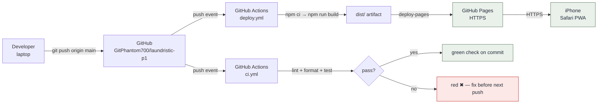
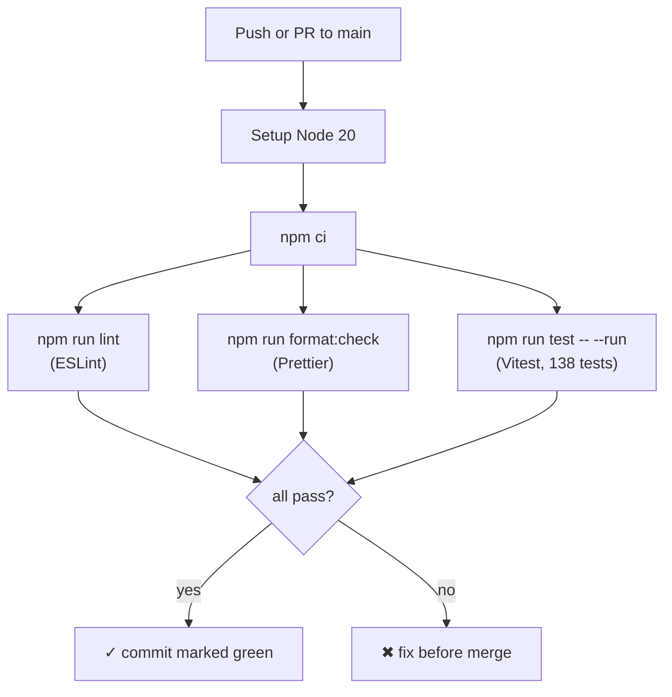
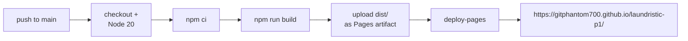

# Deployment Guide

> How the app gets from a commit on `main` to a live PWA on an iPhone. Covers the GitHub repository, the CI pipeline, the GitHub Pages hosting pipeline, and the release process.

---

## 1. At a glance



There is **no manual deploy step** under normal operation. Push to `main` → the deploy workflow builds and publishes to GitHub Pages → user's PWA picks up the new build the next time the tab becomes visible (driven by `registration.update()` on `visibilitychange`).

---

## 2. GitHub repository

| Field              | Value                                           |
| ------------------ | ----------------------------------------------- |
| **URL**            | https://github.com/GitPhantom700/laundristic-p1 |
| **Default branch** | `main`                                          |
| **Visibility**     | Public                                          |
| **License**        | MIT                                             |
| **Issue tracker**  | GitHub Issues                                   |

### Branch strategy (v0.1.x)

- **`main`** — the only long-lived branch. CI must be green before each merge.
- Direct pushes to `main` are allowed (single-developer workflow); for v-next, branch protection + PR review is recommended.

### Tagging

- Annotated tags mark released builds: `v0.1.0`, `v0.1.3`, …
- See `RELEASE_NOTES.md` for what shipped in each.

---

## 3. CI pipeline (GitHub Actions)

**File:** `.github/workflows/ci.yml`



The three gates each fail the build independently — a single Prettier nit fails CI just like a broken test.

> **Tip:** most historical CI failures were `format:check` drift. Run `npx prettier --write .` before every commit (or wire a pre-commit hook) and this never bites.

---

## 4. GitHub Pages hosting

**Live URL:** https://gitphantom700.github.io/laundristic-p1/

### 4.1 Why GitHub Pages

- Free for public repositories — no separate cloud account or billing to manage
- Build and hosting live in the same place as the code (GitHub Actions → Pages)
- HTTPS out of the box (required for service workers and `navigator.share` with files)
- No servers, no CDN configuration, nothing to patch

### 4.2 How it's wired

A **project** Pages site serves from a subpath (`/laundristic-p1/`), not the domain root, so the build is configured for it:

- `vite.config.ts` sets `base: '/laundristic-p1/'` — every emitted asset URL is prefixed with the subpath.
- The PWA manifest's `start_url`, `scope`, and `id` are set to `/laundristic-p1/` so the installed app opens and stays inside the Pages site.
- `index.html` links the favicon and apple-touch-icon via Vite's `%BASE_URL%` token so they resolve on the subpath.

**Deploy workflow** (`.github/workflows/deploy.yml`) — runs on every push to `main` (and manually via _Run workflow_):



**One-time setup (already done):** repo **Settings → Pages → Build and deployment → Source: GitHub Actions**. No branch/folder selection — the workflow owns the deploy.

### 4.3 Environment variables

The app has **no runtime environment variables** (no API keys, no backend URLs — local-first by design). Nothing needs to be configured beyond the workflow file.

### 4.4 Rollback procedure

Two options, no console required:

1. **Re-run an old deploy:** Actions → _Deploy to GitHub Pages_ → open the last good run → **Re-run all jobs**. It rebuilds that commit and republishes it.
2. **Revert the bad commit:**

   ```bash
   git revert <bad-commit-sha>
   git push origin main
   ```

   The deploy workflow republishes automatically.

### 4.5 Common pitfalls

| Symptom                                         | Likely cause                                                  | Fix                                                                                        |
| ----------------------------------------------- | ------------------------------------------------------------- | ------------------------------------------------------------------------------------------ |
| User sees old build after deploy                | PWA cache; `registration.update()` runs on `visibilitychange` | Close + reopen the PWA; we ship `autoUpdate` + `cleanupOutdatedCaches: true`               |
| Blank page / assets 404 after a config change   | `base` path drifted from the repo name                        | `base` in `vite.config.ts` must stay `'/laundristic-p1/'` (renaming the repo changes both) |
| Deploy workflow red on `format:check`           | Prettier drift; CI fails the same way                         | Run `npx prettier --write .` locally, commit, re-push                                      |
| `navigator.share` errors with `NotAllowedError` | Triggered outside a user-gesture handler                      | The "Share PDF" button must be the direct event source — don't share inside a `setTimeout` |

---

## 5. Release checklist

For each tagged release (e.g. `v0.1.4`):

- [ ] All 138 tests passing locally and on CI
- [ ] `npm run lint` clean
- [ ] `npm run format:check` clean
- [ ] `npm run build` succeeds; main bundle ≤ ~210 KB gzip
- [ ] App version bumped in `package.json` AND `src/screens/Settings.tsx` footer
- [ ] `RELEASE_NOTES.md` entry written
- [ ] Commit + push → the Pages deploy workflow publishes automatically
- [ ] On-device smoke test on iPhone: catalog → drop-off → check-in → share PDF
- [ ] `git tag -a v0.1.x -m "…" && git push origin v0.1.x`

---

## 6. Cross-references

- [Solution Design](SOLUTION_DESIGN.md)
- [Technical Design](TECHNICAL_DESIGN.md)
- [Architecture](ARCHITECTURE.md)
- [Contributing](CONTRIBUTING.md) — local dev setup
