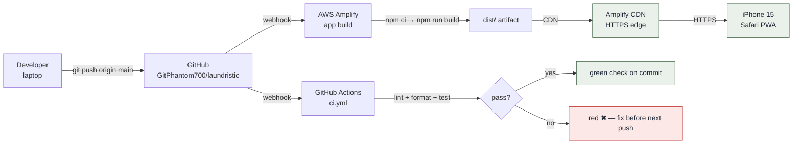
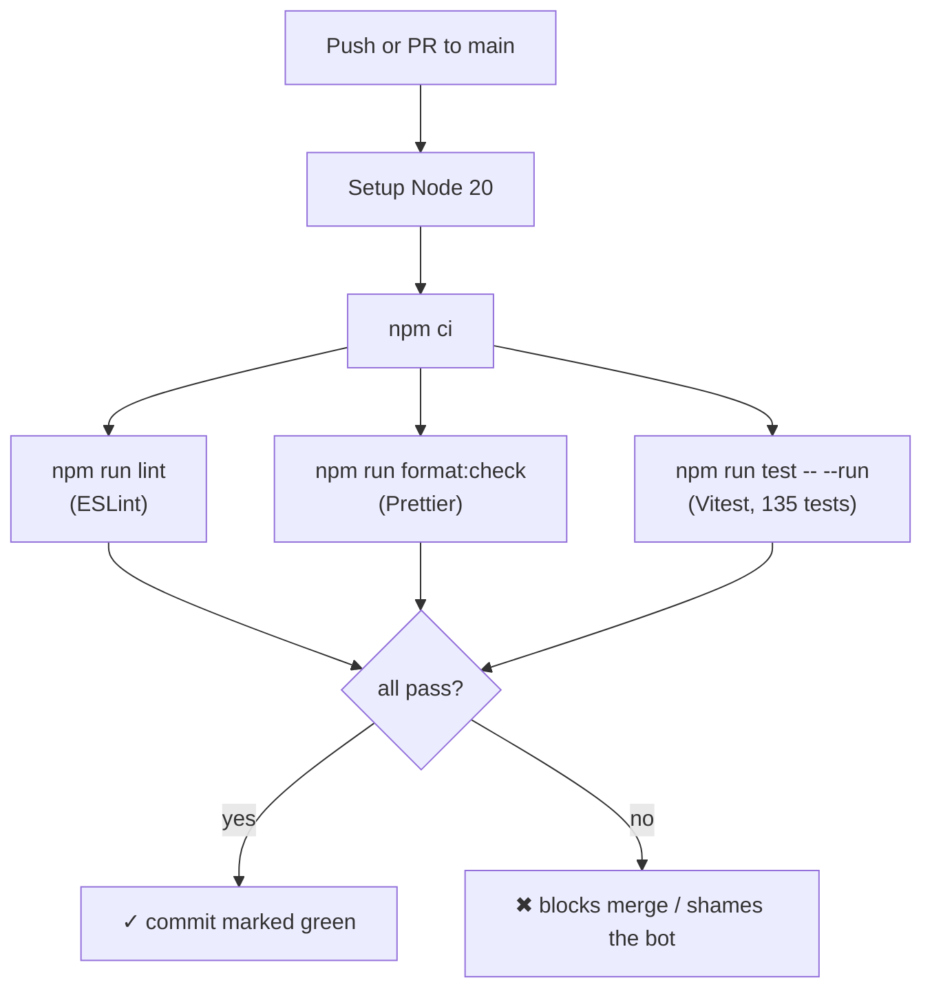
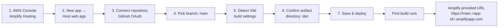
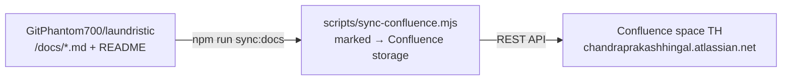

# Deployment Guide

> How the app gets from a commit on `main` to a live PWA on an iPhone. Covers the GitHub repository, the CI pipeline, the AWS Amplify hosting pipeline, the release process, and the Confluence docs mirror.

---

## 1. At a glance



There is **no manual deploy step** under normal operation. Push to `main` → Amplify rebuilds → CDN cache invalidates → user's PWA picks up the new build the next time the tab becomes visible (driven by `registration.update()` on `visibilitychange`).

---

## 2. GitHub repository

| Field              | Value                                                                         |
| ------------------ | ----------------------------------------------------------------------------- |
| **URL**            | https://github.com/GitPhantom700/laundristic                                  |
| **Default branch** | `main`                                                                        |
| **Visibility**     | Public                                                                        |
| **License**        | MIT                                                                           |
| **Issue tracker**  | GitHub Issues (not currently in active use; project ships from `PROGRESS.md`) |

### Branch strategy (v0.1.x)

- **`main`** — the only long-lived branch. CI must be green before each merge.
- Direct pushes to `main` are allowed (single-developer workflow); for v-next, branch protection + PR review is recommended.

### Tagging

- Annotated tags mark released builds: `v0.1.0`, `v0.1.3`, …
- See `RELEASE_NOTES.md` for what shipped in each.

---

## 3. CI pipeline (GitHub Actions)

**File:** `.github/workflows/ci.yml`



The three gates each fail the build independently — a single Prettier nit fails CI just like a broken test.

> **AG note:** Prior runs (#33, #34, #35) failed on `format:check` because the AG lane skipped `npx prettier --write .` before committing. The fix is mechanical: run Prettier locally before every commit, or wire a pre-commit hook.

---

## 4. AWS Amplify hosting

### 4.1 Why Amplify

- Free tier covers a single static PWA generously
- Auto-builds on `git push` with zero pipeline plumbing
- HTTPS + global CDN out of the box (required for service workers and `navigator.share` with files)
- No EC2 / Lambda / database to manage

### 4.2 First-time setup (one-time, already done)

The steps below are recorded so this deployment is reproducible from scratch — e.g. when forking a v-next environment.



**Step-by-step:**

1. **Sign in to AWS** at https://console.aws.amazon.com and open **Amplify Hosting** (region: any; Amplify is global).
2. Click **Create new app → Host web app**.
3. Select **GitHub** as the source provider; authorise the Amplify GitHub App against the `GitPhantom700/laundristic` repo. _Use the GitHub App, not classic OAuth — the App scope is per-repo._
4. Pick branch **`main`** as the deploy branch.
5. Amplify auto-detects Vite. Confirm:
   - **Build command:** `npm run build`
   - **Output (artifact) directory:** `dist`
   - **Node version:** 20 (matches CI)
6. _(Optional)_ configure a custom domain under **Domain management**. The free `*.amplifyapp.com` URL is sufficient for v0.1.x.
7. Click **Save and deploy**. The first build runs immediately.

### 4.3 `amplify.yml` (build settings)

If you want to lock the build spec in-repo instead of relying on Amplify's auto-detect, drop the following at the repo root:

```yaml
version: 1
frontend:
  phases:
    preBuild:
      commands:
        - npm ci
    build:
      commands:
        - npm run build
  artifacts:
    baseDirectory: dist
    files:
      - '**/*'
  cache:
    paths:
      - node_modules/**/*
```

_v0.1.x ships without `amplify.yml` and uses Amplify's auto-detected defaults — both work._

### 4.4 Environment variables

The app has **no runtime environment variables** (no API keys, no backend URLs — local-first by design). The only env-var-dependent piece is the Confluence sync script (`scripts/sync-confluence.mjs`), which reads `.env` locally and does **not** need to run in Amplify.

### 4.5 Rollback procedure

Amplify keeps every successful build. To roll back:

1. Open the Amplify console → app → **Deployments** tab.
2. Find the last good build → **Redeploy this version**.

For a deeper rollback (revert a commit on `main`):

```bash
git revert <bad-commit-sha>
git push origin main
```

Amplify rebuilds automatically. **Do not force-push to `main`** — Amplify caches behave best with linear history.

### 4.6 Common pitfalls

| Symptom                                                    | Likely cause                                                  | Fix                                                                                        |
| ---------------------------------------------------------- | ------------------------------------------------------------- | ------------------------------------------------------------------------------------------ |
| User sees old build after deploy                           | PWA cache; `registration.update()` runs on `visibilitychange` | Close + reopen the PWA; we ship `autoUpdate` + `cleanupOutdatedCaches: true`               |
| Camera close button looks broken on phone but works in dev | Service-worker cached old asset                               | Same as above; or bump app version to invalidate SW                                        |
| Amplify build fails on `format:check`                      | Prettier drift; CI also fails                                 | Run `npx prettier --write .` locally, commit, re-push                                      |
| `navigator.share` errors with `NotAllowedError`            | Triggered outside a user-gesture handler                      | The "Share PDF" button must be the direct event source — don't share inside a `setTimeout` |

---

## 5. Confluence docs mirror

The repository markdown in `/docs` is **the source of truth**. Confluence is a one-way mirror published by `scripts/sync-confluence.mjs` (package P4.3, AG-owned).



**Workflow:**

1. Author / edit Markdown in `/docs`. Commit.
2. Locally (with `.env` set):

   ```bash
   npm run sync:docs           # actually push to Confluence
   npm run sync:docs -- --dry-run  # preview operations, no API calls
   ```

3. Confirm pages in the Confluence space.

**Credentials:** Never check in `.env`. Generate Atlassian API tokens at https://id.atlassian.com/manage-profile/security/api-tokens and store locally only. **If a token is ever pasted in chat, code, or any shared surface — rotate it immediately.**

**Files mirrored** (whitelist in `sync-confluence.mjs`):

- `README.md`, `RELEASE_NOTES.md`
- `docs/SOLUTION_DESIGN.md`, `docs/TECHNICAL_DESIGN.md`, `docs/DEPLOYMENT.md` _(added in this design pass)_
- `docs/ARCHITECTURE.md`, `docs/DATA_MODEL.md`, `docs/USER_GUIDE.md`
- `docs/CONTRIBUTING.md`, `docs/ROADMAP.md`, `docs/SPEC.md`, `docs/ADMIN_APP.md`

**Files explicitly NOT mirrored** (internal-team scaffolding):

- `CLAUDE.md`, `AGENTS.md`, `KICKOFF.md`, `PROGRESS.md`
- `docs/PLAN.md`, `docs/PLAYBOOK-TEMPLATE.md`, `docs/coverage.md`
- `docs/qa/README.md`

---

## 6. Release checklist

For each tagged release (e.g. `v0.1.4`):

- [ ] All 135 tests passing locally and on CI
- [ ] `npm run lint` clean
- [ ] `npm run format:check` clean
- [ ] `npm run build` succeeds; main bundle ≤ ~210 KB gzip
- [ ] App version bumped in `package.json` AND `src/screens/Settings.tsx` footer
- [ ] `RELEASE_NOTES.md` entry written
- [ ] `PROGRESS.md` decision logged
- [ ] `ROADMAP.md` status updated
- [ ] Commit + push → Amplify auto-deploy
- [ ] On-device smoke test on iPhone 15: catalog → drop-off → check-in → share PDF
- [ ] `npm run sync:docs` to mirror updated docs to Confluence
- [ ] `git tag -a v0.1.x -m "…" && git push origin v0.1.x`

---

## 7. Cross-references

- [Solution Design](SOLUTION_DESIGN.md)
- [Technical Design](TECHNICAL_DESIGN.md)
- [Architecture](ARCHITECTURE.md)
- [Contributing](CONTRIBUTING.md) — local dev setup
- [Roadmap](ROADMAP.md) — package status
