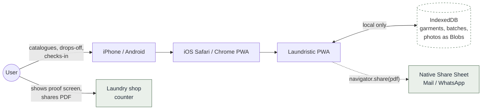

# Solution Design

> A solution-level view of what Laundristic is, who it's for, what problem it solves, and how it's structured at the top. Pair this with [Technical Design](TECHNICAL_DESIGN.md) for the engineering detail.

| Field          | Value                                                                                |
| -------------- | ------------------------------------------------------------------------------------ |
| **Status**     | v0.1.x — Shipping                                                                    |
| **Owner**      | GitPhantom700                                                                |
| **Repository** | [github.com/GitPhantom700/laundristic](https://github.com/GitPhantom700/laundristic) |
| **Live URL**   | AWS Amplify (see [Deployment](DEPLOYMENT.md))                                        |
| **Confluence** | [Laundristic space (TH)](https://your-domain.atlassian.net/wiki/spaces/YOURKEY/) |
| **License**    | MIT                                                                                  |

---

## 1. Executive summary

Laundristic is a **local-first Progressive Web App** that helps a single user track garments dropped at a laundry shop, reconcile what comes back, and prove what's missing — entirely on their own device, with no accounts, no cloud, and no internet required after first load.

Where most "laundry tracker" apps assume a SaaS account, Laundristic assumes the opposite: **your data lives in your phone's IndexedDB**, photos are stored as binary blobs, and the only network requirement is the initial PWA install. The whole core loop — catalog → drop-off → check-in → resolve missing → proof at counter — works offline.

The app ships as an installable PWA targeting **iOS Safari first**, Android Chrome second.

---

## 2. Problem statement

People who hand laundry to a shop every week face a recurring failure mode:

1. They count items when handing them over, but don't _catalogue_ them.
2. When items come back short, they have no proof of what was sent.
3. The shop's paper receipt rarely lists individual items.
4. The argument at the counter goes badly — there's no evidence.

Existing apps either solve the wrong problem (inventory management for businesses) or impose friction the casual user won't tolerate (accounts, typing item names, multi-screen forms). The friction kills adoption _before_ the missing-item incident happens.

**Laundristic's bet:** if catalogue-as-you-go is reduced to _snap-photo + tap-category + done_ (no typing, no naming), people will actually do it, and they'll have the proof when they need it.

---

## 3. Users & use cases

### Primary user

A single individual who:

- Hands clothes to a laundry / dry-cleaning shop on a recurring basis (weekly is typical)
- Owns an iPhone or Android phone
- Doesn't want to manage accounts, cloud sync, or "household members"
- Cares about reimbursement / accountability when items go missing

### Out of scope (explicit non-users)

- Laundry-shop businesses (this is not a POS or inventory system)
- Multi-user / family-share scenarios
- Anyone needing cross-device sync — that requires a backend the SPEC forbids

### Core use cases

| #   | Use case                                  | Frequency                          | Acceptance                                     |
| --- | ----------------------------------------- | ---------------------------------- | ---------------------------------------------- |
| UC1 | Catalogue a new garment                   | Episodic (when buying new clothes) | < 10 s from camera to saved                    |
| UC2 | Drop off a batch at the shop              | Weekly                             | ≤ 3 taps to start if shop is same as last time |
| UC3 | Check in a returned batch (happy path)    | Weekly                             | 1 tap to close if count matches                |
| UC4 | Reconcile a partial return (short path)   | Occasional                         | One row per item, found / lost in single tap   |
| UC5 | Present proof of missing items at counter | Rare but high-stakes               | Receipt + photo on one screen, zero navigation |
| UC6 | Email a receipt PDF for reimbursement     | Occasional                         | One tap → native share sheet → Mail            |
| UC7 | Back up / restore data across devices     | Rare                               | Single ZIP file via Settings                   |

---

## 4. Solution overview

### System context

The diagram emphasises what is **absent**: no application server, no database, no analytics, no auth provider. The entire app runs in the browser sandbox.

### Solution pillars

| Pillar                | What it means                                             | Where it's enforced                                             |
| --------------------- | --------------------------------------------------------- | --------------------------------------------------------------- |
| **Local-first**       | All state in IndexedDB; no API calls during normal use    | `src/lib/storage.ts`, no `fetch` in app code                    |
| **Offline-capable**   | Full core loop works in airplane mode after first install | `vite-plugin-pwa` service worker, `navigator.storage.persist()` |
| **Photo-first UX**    | Every screen prefers visual evidence over text            | `useCamera` hook, photo blobs everywhere                        |
| **No-typing default** | Categories, codes, counts — all tap-driven                | Catalog flow, count-first check-in                              |
| **Frozen scope**      | New features go to v1.1; v0.1.x stays small               | `docs/SPEC.md §OUT`, two-lane workflow                          |

### Tech stack (frozen)

- **Vite + React 18** — minimal bundler, no framework lock-in
- **Plain CSS** with custom properties (Fraunces + Hanken Grotesk), no Tailwind/styled-components
- **`idb`** — Promise wrapper for IndexedDB
- **`vite-plugin-pwa`** — manifest, service worker, offline cache
- **`pdf-lib`** — receipt PDF generation, lazy-loaded
- **Vitest + React Testing Library** — unit & integration tests (135 tests at freeze)

No backend. No state library. No analytics. No CSS framework.

---

## 5. Key design decisions

Each is a deliberate trade-off, captured here so reviewers don't have to rediscover them:

| #   | Decision                                                      | Rationale                                                                                                                    | Cost accepted                                                                 |
| --- | ------------------------------------------------------------- | ---------------------------------------------------------------------------------------------------------------------------- | ----------------------------------------------------------------------------- |
| KD1 | **Single-user, local-only** — no accounts, no sync            | Eliminates ~80% of typical app surface area (auth, server, conflict resolution). Aligns with user reality (it's their phone) | No cross-device sync; backup/restore via ZIP file                             |
| KD2 | **IndexedDB Blob storage**, never base64                      | Photos are large; base64 inflates by ~33% and bloats JSON                                                                    | Slightly more code to convert Blob ↔ ArrayBuffer for jsdom tests              |
| KD3 | **State-based "routing"** instead of React Router             | Four screens, bottom nav — a library is overkill                                                                             | Hand-rolled `activeTab` state                                                 |
| KD4 | **Custom CSS, no Tailwind**                                   | Smaller bundle, total control of iOS Safari quirks (16px inputs, safe-area insets)                                           | More CSS to maintain                                                          |
| KD5 | **Soft-delete via `'returned'` status** for returned garments | Closed-batch history and shared PDFs must still resolve garment photo/code; hard delete would break the receipt              | Slow disk growth — addressed by ZIP export, future hard-delete fork if needed |
| KD6 | **`pdf-lib` for receipt PDF**, replacing `window.print()`     | `window.print()` + `@media print` produces blank pages on iOS; `pdf-lib` embeds JPEGs verbatim at full resolution            | One new dependency, ~400 KB lazy-loaded chunk                                 |
| KD7 | **Two-lane (CC/AG) workflow**                                 | Separates scalpel (logic/domain) from volume (UI/docs) — avoids merge conflicts when using two AI assistants in parallel     | Process overhead documented in `CLAUDE.md` and `AGENTS.md`                    |

---

## 6. Trade-offs accepted

These are _not_ bugs — they're conscious limits of v0.1.x.

- **No cross-device sync.** The user is expected to use ZIP export/import to move between devices. Sync is parked in v1.1.
- **No telemetry.** We don't know how many users install or where they get stuck. Privacy was prioritised over product analytics.
- **No password / lock screen.** Anyone with the unlocked phone can see receipts. The user's phone-level lock is the boundary.
- **iOS-first.** Android Chrome works but receives less device-test attention.
- **English-only UI.** Hindi UI is in the v1.1 parking lot.
- **Standard-14 PDF font (Helvetica).** Non-Latin shop names are sanitised to ASCII in PDFs — a Unicode-font embed is deferred.

---

## 7. Success metrics

We deliberately ship no telemetry, so success is measured by the user, not the app:

- **Adoption proxy:** does the user actually catalogue items, week after week? (If they stop, the UX failed.)
- **Reimbursement event:** can the user point at a screen and prove a missing item the shop denies?
- **Drop-off speed:** repeat drop-off ≤ 3 taps to the receipt step.

These are validated by the user's own usage, not by a dashboard.

---

## 8. Roadmap pointer

The build is delivered in phased work packages (P0 through P5) along two lanes (CC = scalpel, AG = volume). The full plan, package ownership, and current status live in:

- [`ROADMAP.md`](ROADMAP.md) — package-level status, "what's done / what's next"
- [`PLAN.md`](PLAN.md) — ownership map, lane rules, phase boundaries
- [`SPEC.md`](SPEC.md) — frozen scope, north-star principles, the explicit "do not build" list

v0.1.x is being shipped as a frozen reference base. Future work (Admin App, launch review, iOS-memory escalation, sync, OCR, etc.) moves to a forked v-next branch.

---

## 9. Cross-references

- [Technical Design](TECHNICAL_DESIGN.md) — diagrams, state machines, sequence flows
- [Deployment](DEPLOYMENT.md) — AWS Amplify pipeline, GitHub repo, CI/CD
- [Architecture](ARCHITECTURE.md) — implementation-level architecture notes
- [Data Model](DATA_MODEL.md) — IndexedDB schema and state transitions
- [User Guide](USER_GUIDE.md) — end-user walkthrough
