# Technical Design

> Engineering-level companion to [Solution Design](SOLUTION_DESIGN.md). All diagrams are Mermaid and render natively on GitHub.

| Field          | Value                                                                                      |
| -------------- | ------------------------------------------------------------------------------------------ |
| **Version**    | v0.1.3                                                                                     |
| **Test suite** | 135 tests (Vitest)                                                                         |
| **Build**      | Vite 5 + `vite-plugin-pwa`                                                                 |
| **Repo**       | [github.com/GitPhantom700/laundristic-p1](https://github.com/GitPhantom700/laundristic-p1) |

---

## 1. Architecture at a glance

Laundristic is a single-page React application with strict layering: **UI components** depend on **domain library**, which depends on **storage**, which depends on **IndexedDB**. The dependency arrow never reverses.

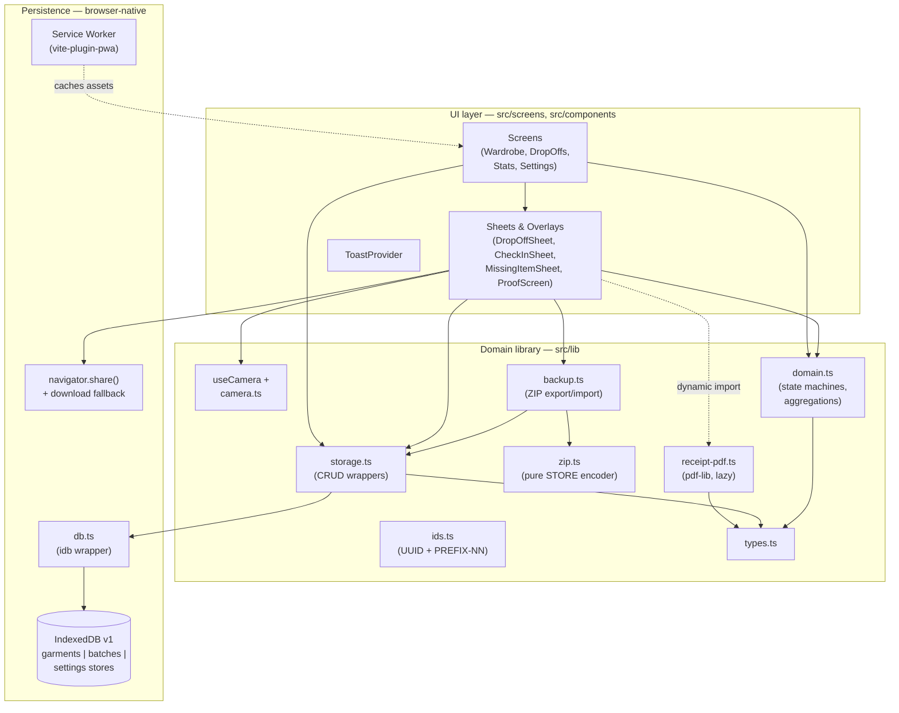

Two lazy-loaded boundaries are deliberate:

1. `pdf-lib` (~400 KB) is only fetched when the user taps **Share PDF**. Code-split via dynamic `import()` in `ProofScreen.tsx`.
2. The service worker registers asynchronously, so a slow SW install never blocks the first paint.

---

## 2. Module breakdown

### `src/lib` (pure / unit-tested)

| Module                       | Responsibility                                            | LOC class |
| ---------------------------- | --------------------------------------------------------- | --------- |
| `types.ts`                   | `Garment`, `Batch`, `BatchItem`, `Settings`, enums        | Tiny      |
| `db.ts`                      | `idb` schema v1 + Blob ↔ ArrayBuffer round-trip           | Small     |
| `storage.ts`                 | CRUD + `setGarmentStatus`, `getBatchesByStatus`, persist  | Medium    |
| `domain.ts`                  | Batch & item state machines, code generator, aggregations | Largest   |
| `ids.ts`                     | UUID generator + `PREFIX-NN` code allocator               | Small     |
| `camera.ts` + `useCamera.ts` | `getUserMedia`, downscale, JPEG capture                   | Medium    |
| `backup.ts` + `zip.ts`       | ZIP export/import with integrity check                    | Medium    |
| `receipt-pdf.ts`             | A4 receipt PDF via `pdf-lib` (lazy-loaded)                | Small     |

### `src/components` & `src/screens` (UI / integration-tested in browser)

Screens are top-level routes (`Wardrobe`, `DropOffs`, `Stats`, `Settings`, `Catalog`). Components are bottom-sheets and overlays (`DropOffSheet`, `CheckInSheet`, `MissingItemSheet`, `ProofScreen`, `EditGarmentSheet`, `BatchDetailsSheet`, `InstallPrompt`, `ToastProvider`).

UI imports `lib`; **`lib` never imports UI**. Enforced by directory convention.

---

## 3. Data model

### Entity relationships

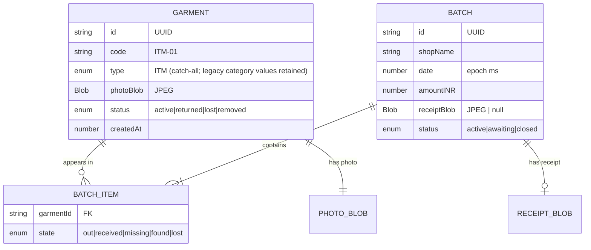

`BatchItem` is embedded inside `Batch.items[]` — not a separate IndexedDB store. This keeps batch operations transactional in one read/write.

### Schema versioning

The IDB schema is **v1**. `Settings.schemaVersion` is recorded for future migrations; no migration has run yet.

### Why Blob ↔ ArrayBuffer

`StoredBlob = { buffer: ArrayBuffer, type: string }` is the on-disk shape. Public storage API returns reconstituted `Blob`s. This decouples us from jsdom's incomplete `Blob.arrayBuffer()` support during tests — all conversion goes through `FileReader.readAsArrayBuffer()` instead.

---

## 4. State machines

The integrity of the missing-item loop depends entirely on these transitions being airtight. All are pure functions in `src/lib/domain.ts` and tested by `tests/domain.test.ts` + `tests/property.test.ts`.

### 4.1 Batch lifecycle

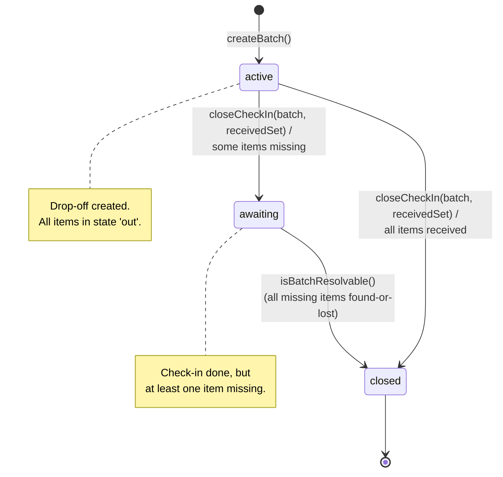

### 4.2 BatchItem lifecycle

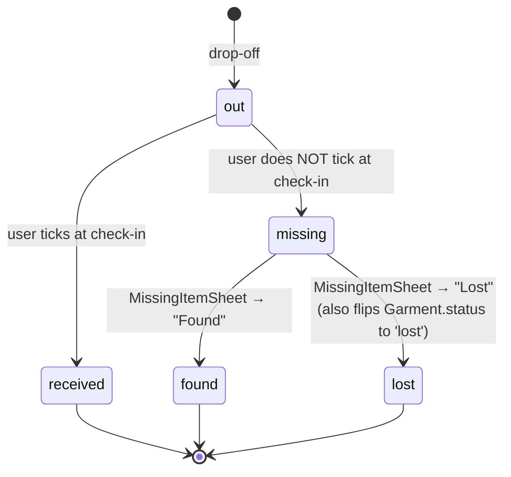

### 4.3 Garment lifecycle (soft delete)

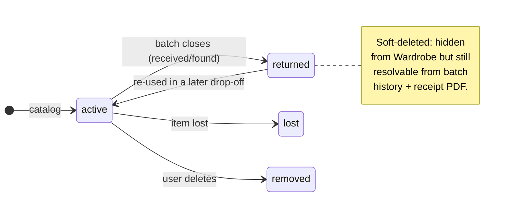

The Wardrobe screen filters strictly on `status === 'active'`. The three non-active states are kept in IDB so closed-batch receipts and shared PDFs still render the garment's photo and code. _(P4.5 decision, see PROGRESS.)_

---

## 5. Critical flows (sequence diagrams)

### 5.1 Catalogue a new garment

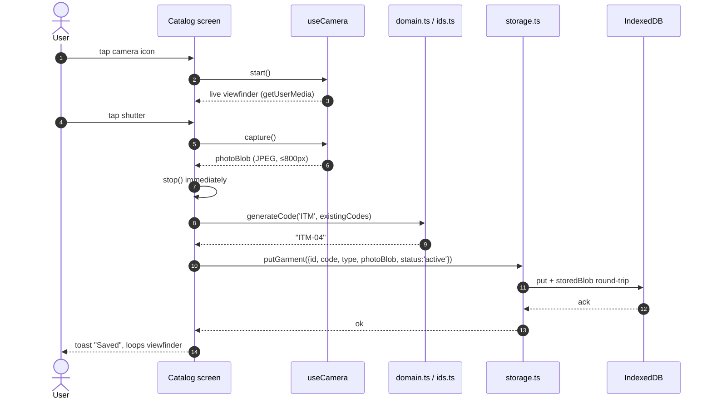

### 5.2 Drop-off

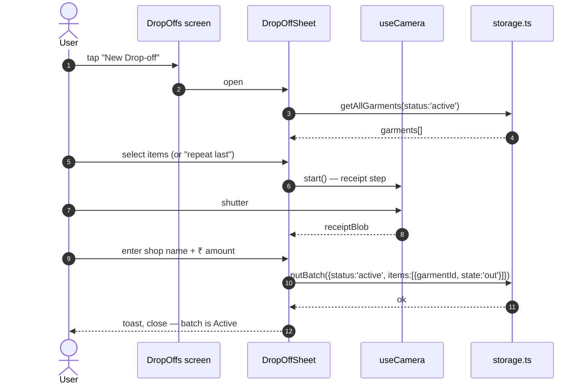

### 5.3 Check-in — happy path

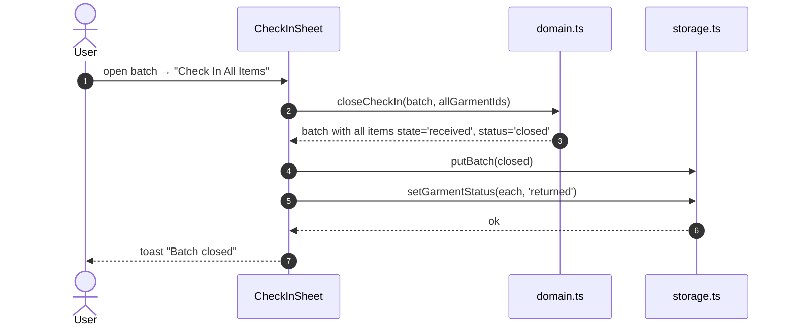

### 5.4 Check-in — short path → missing-item loop

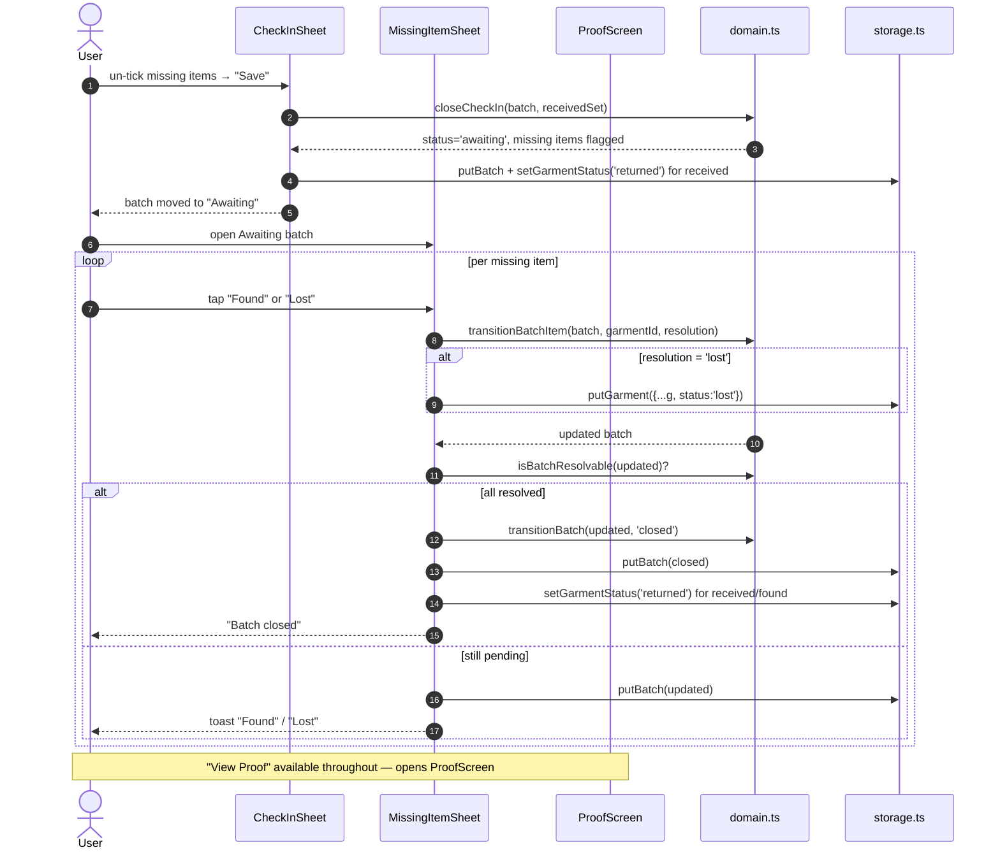

### 5.5 Receipt PDF share

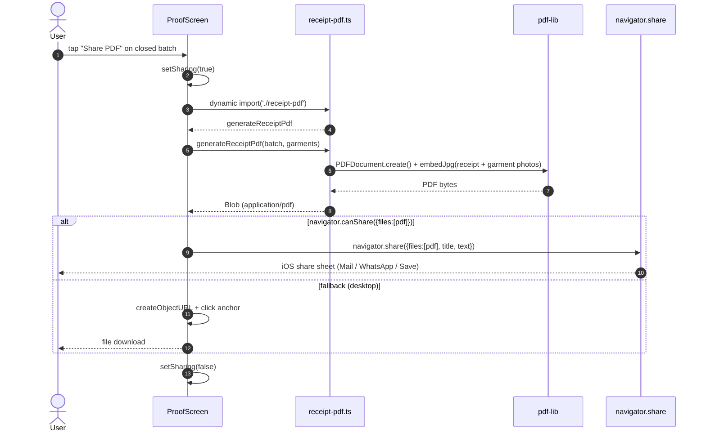

---

## 6. PWA & offline strategy

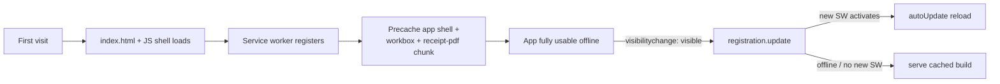

Key choices:

- **`registerType: 'autoUpdate'`** in `vite-plugin-pwa` — newer service workers activate as soon as the user returns to the tab.
- **`cleanupOutdatedCaches: true`** — prevents the precache from accumulating stale assets across versions.
- **`navigator.storage.persist()`** is requested once on first run — without it iOS can evict IDB under storage pressure.
- **Code-split `pdf-lib`** still ends up in the precache (Workbox treats it as a build artifact), so PDF share works offline after first install.

---

## 7. Performance characteristics

| Metric                  | Value                                | Where measured                     |
| ----------------------- | ------------------------------------ | ---------------------------------- |
| Main JS bundle          | **201 KB** (61.7 KB gzip)            | `npm run build`                    |
| `pdf-lib` chunk (lazy)  | 431 KB (178.6 KB gzip)               | code-split, fetched on first Share |
| CSS bundle              | 19.9 KB (4.2 KB gzip)                | single file                        |
| Tests                   | 135 in ~3 s                          | `npm run test -- --run`            |
| First-paint asset count | 10 precached entries (~643 KB total) | `vite-plugin-pwa` log              |

### iOS-memory tunings (live device findings)

- **Camera capture max dimension:** 800 px (originally 1200) — cuts new-photo heap footprint ~60%.
- **JPEG quality:** 0.75 (originally 0.82) — visually indistinguishable on phone screens.
- **`loading="lazy"`** on every `` in lists — defers GPU pixel-decode for off-screen items.

Escalation path (deferred to v-next): IDB migration to recompress old photos; pagination of `getAllGarments()`.

---

## 8. Testing strategy

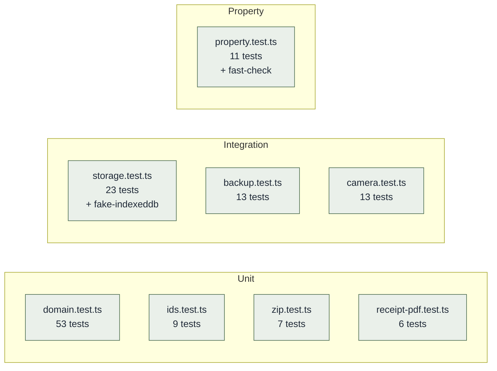

- **Unit tests** target pure functions with literal inputs.
- **Integration tests** for storage use `fake-indexeddb` — the IDB API runs in jsdom without a browser.
- **Property tests** (`fast-check`) generate random batches and assert invariants: e.g. _for any sequence of transitions, a batch never ends up in an illegal state_.
- CI runs `npm run lint` + `npm run format:check` + `npm run test -- --run` on every push.

---

## 9. Security & privacy posture

| Concern                        | Posture                                                                                                                                          |
| ------------------------------ | ------------------------------------------------------------------------------------------------------------------------------------------------ |
| **PII leakage**                | None — no network calls during the core loop, no analytics, no remote logging                                                                    |
| **Data at rest**               | IndexedDB in the browser sandbox; user's OS-level disk encryption is the boundary                                                                |
| **Auth**                       | None by design — single-user, on-device. The phone's lock screen is the gate                                                                     |
| **Receipt-PDF text injection** | All free-text fields (shop name) are sanitised to printable ASCII before drawing in PDF, preventing `drawText` crashes on non-WinAnsi characters |
| **Service worker scope**       | Limited to app origin; no cross-origin caching                                                                                                   |
| **Dependencies**               | 4 runtime deps (`react`, `react-dom`, `idb`, `pdf-lib`); audited via `npm audit` in CI                                                           |

The threat model is small because the attack surface is small. Anything we don't ship can't be exploited.

---

## 10. Build & release

- **Vite 5** produces `dist/` with hashed asset filenames.
- **`vite-plugin-pwa`** emits the manifest, icons, and service worker (`sw.js`, `workbox-*.js`).
- **GitHub Actions** runs lint + format + tests on every push (`.github/workflows/ci.yml`).
- **GitHub Pages** deploys on every push to `main` (`.github/workflows/deploy.yml`) and serves the PWA over HTTPS at [gitphantom700.github.io/laundristic-p1](https://gitphantom700.github.io/laundristic-p1/). See [Deployment](DEPLOYMENT.md).

---

## 11. Cross-references

- [Solution Design](SOLUTION_DESIGN.md) — problem framing, users, success metrics
- [Architecture](ARCHITECTURE.md) — narrative implementation notes
- [Data Model](DATA_MODEL.md) — schema reference with TypeScript snippets
- [Deployment](DEPLOYMENT.md) — GitHub Pages pipeline, GitHub repo, CI/CD
- [User Guide](USER_GUIDE.md) — end-user flow with screenshots
